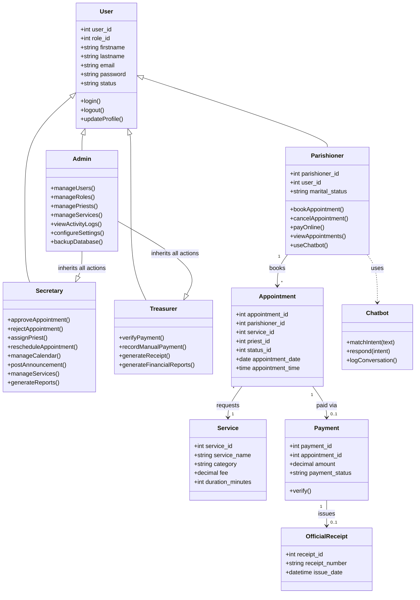

# PARISHHUB — Class Diagram

Since PARISHHUB uses raw SQL rather than an ORM, there are no formal "model classes" — but the same responsibilities are cleanly separated by controller. This diagram represents the logical entities and the operations available on each, as implemented across the controller layer.

## Notes
- `Admin` is modeled as inheriting all `Secretary` and `Treasurer` capabilities — enforced in code via `requireRole('Secretary','Admin')` and `requireRole('Treasurer','Admin')` guards at the top of each page file, rather than class inheritance (since this is a procedural PHP app, not an OOP domain model).
- Each "class" above corresponds to a role folder (`parishioner/`, `secretary/`, `treasurer/`, `admin/`) and its page files, which combine controller logic and view rendering per screen — see `docs/architecture.md`.
