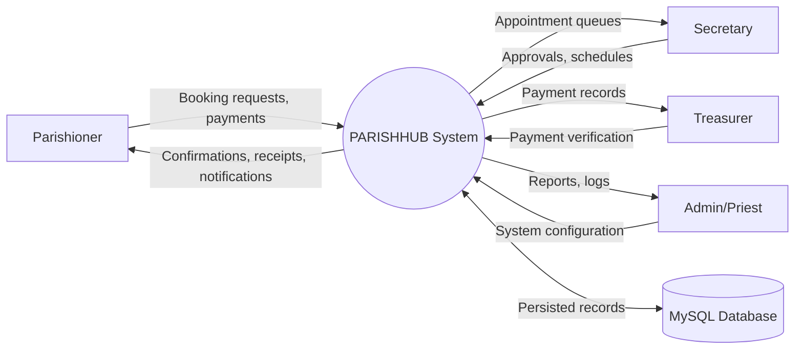
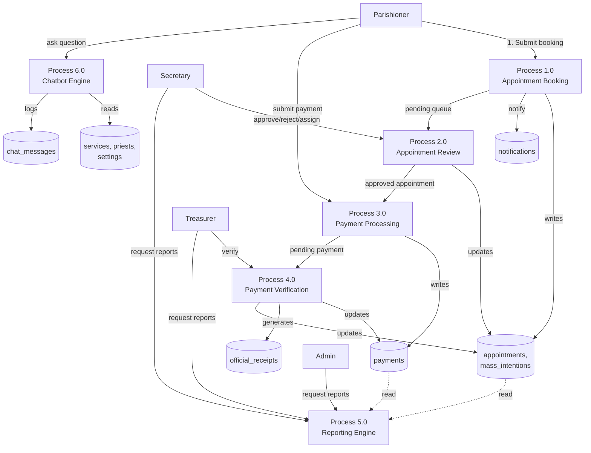

# PARISHHUB — Data Flow Diagram (Level 0 & 1)

## Level 0 (Context Diagram)

## Level 1 (Major Processes)

## Process Descriptions

| Process | Input | Output | Implemented In |
|---|---|---|---|
| 1.0 Appointment Booking | Service selection, date/time, mass intention details, documents | New `appointments` row (status=Pending), notification | `parishioner/book.php` (POST handler) |
| 2.0 Appointment Review | Pending appointments | Approved/Rejected status, priest assignment, reschedule | `secretary/appointment-detail.php` (approve/reject/assign_priest/reschedule actions) |
| 3.0 Payment Processing | Approved appointment, payment details | New `payments` row (status=pending) | `parishioner/pay.php`, `treasurer/payments.php` (manual action) |
| 4.0 Payment Verification | Pending payment | Verified payment, official receipt, appointment status update | `treasurer/payment-detail.php` (verify action) |
| 5.0 Reporting Engine | Date ranges, filters | Aggregated revenue/appointment statistics | `*/reports.php` (per role) |
| 6.0 Chatbot Engine | Free-text question | Matched FAQ answer from live DB data | `chatbot.php` |
