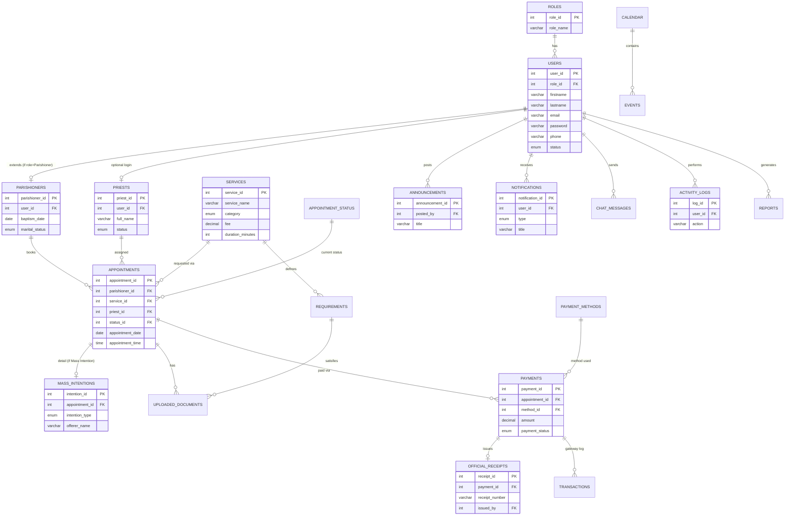

# PARISHHUB — Entity Relationship Diagram

> Paste the Mermaid block below into [mermaid.live](https://mermaid.live) or view it directly in VS Code with the "Markdown Preview Mermaid Support" extension.

## Full Table List (22 tables)

| # | Table | Purpose |
|---|---|---|
| 1 | `roles` | Parishioner / Secretary / Treasurer / Admin |
| 2 | `permissions` + `role_permissions` | Fine-grained permission keys, optional extension point beyond role-based checks |
| 3 | `users` | Base account for every human in the system |
| 4 | `parishioners` | Extends `users` with sacrament/marital data (1:1) |
| 5 | `priests` | Roster of priests (may or may not have a login) |
| 6 | `services` | Catalog of bookable services (Mass Intention types, Sacraments, Blessings) with fee & duration |
| 7 | `requirements` | Per-service list of required documents |
| 8 | `appointment_status` | Lookup: Pending, Approved, Rejected, Payment Verified, Confirmed, Completed, Cancelled |
| 9 | `appointments` | Central booking record — links parishioner, service, priest, status, date/time |
| 10 | `mass_intentions` | Detail row specific to Mass Intention bookings (offerer, intention type, message) |
| 11 | `uploaded_documents` | Files uploaded against an appointment/requirement |
| 12 | `calendar` | Blockable dates (e.g. diocesan holidays — no bookings allowed) |
| 13 | `events` | Parish activity calendar (feasts, fiestas, seminars) |
| 14 | `announcements` | Parish-wide announcements, pinnable |
| 15 | `payment_methods` | Cash, GCash, Maya, Bank Transfer, Card |
| 16 | `payments` | Payment attempts/records tied to an appointment |
| 17 | `transactions` | Raw gateway log (for future online payment gateway integration) |
| 18 | `official_receipts` | Auto-generated OR upon payment verification |
| 19 | `notifications` | In-app (and future email/SMS) notifications per user |
| 20 | `chat_messages` | Chatbot conversation log (user + bot turns, matched intent) |
| 21 | `activity_logs` | Full audit trail of state-changing actions |
| 22 | `reports` | Metadata for generated report exports |
| — | `settings` | Key-value store for parish info & branding (name, address, mass schedule, theme colors) |

## Key Design Decisions
- **`appointments` is the hub** — nearly everything (payments, documents, mass intention detail) hangs off an `appointment_id`, mirroring the real-world workflow where a parishioner requests *one* service at a time.
- **Soft role extension**: rather than separate `parishioner_users`, `secretary_users` tables, all humans live in one `users` table with a `role_id`; `parishioners` and `priests` are optional 1:1 extension tables holding role-specific fields. This keeps auth logic in one place.
- **Status as a lookup table**, not an ENUM on `appointments`, so the workflow states can be extended (e.g. add "Awaiting Documents") without a schema migration touching the ENUM definition.
