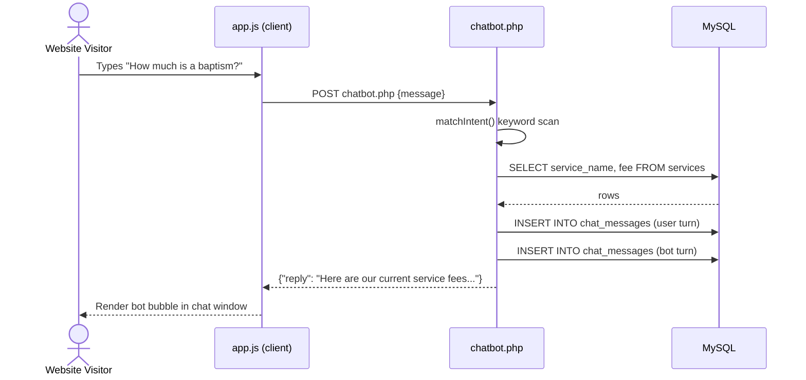

# PARISHHUB (PHP Edition) — Sequence Diagram

## Booking → Approval → Payment → Receipt (the core workflow)

```mermaid
sequenceDiagram
    actor Par as Parishioner
    participant PHP as PHP / Apache
    participant DB as MySQL (via PDO)
    actor Sec as Secretary
    actor Treas as Treasurer

    Par->>PHP: POST parishioner/book.php (service, date, intention)
    PHP->>DB: BEGIN TRANSACTION
    PHP->>DB: SELECT calendar WHERE date blocked?
    DB-->>PHP: not blocked
    PHP->>DB: INSERT INTO appointments (status=Pending)
    PHP->>DB: INSERT INTO mass_intentions (if applicable)
    PHP->>DB: INSERT INTO notifications
    PHP->>DB: COMMIT
    PHP-->>Par: Redirect to appointment-detail.php (Pending)

    Sec->>PHP: GET secretary/appointments.php
    PHP->>DB: SELECT pending appointments (JOIN services, users, status)
    DB-->>PHP: rows
    PHP-->>Sec: Render appointment queue

    Sec->>PHP: POST secretary/appointment-detail.php (action=approve, csrf_token)
    PHP->>PHP: verifyCsrf()
    PHP->>DB: UPDATE appointments SET status=Approved
    PHP->>DB: INSERT INTO notifications (Approved)
    PHP->>DB: INSERT INTO activity_logs
    PHP-->>Sec: Redirect with success flash

    Par->>PHP: POST parishioner/pay.php (method, reference, amount, csrf_token)
    PHP->>DB: INSERT INTO payments (status=pending)
    PHP-->>Par: Redirect with "awaiting verification"

    Treas->>PHP: GET treasurer/payments.php?status=pending
    PHP->>DB: SELECT pending payments
    DB-->>PHP: rows
    PHP-->>Treas: Render payment queue

    Treas->>PHP: POST treasurer/payment-detail.php (action=verify, csrf_token)
    PHP->>DB: BEGIN TRANSACTION
    PHP->>DB: UPDATE payments SET status=verified
    PHP->>DB: UPDATE appointments SET status='Payment Verified'
    PHP->>DB: INSERT INTO official_receipts (receipt_number)
    PHP->>DB: INSERT INTO notifications (Payment Verified)
    PHP->>DB: COMMIT
    PHP-->>Treas: Redirect showing generated receipt

    Par->>PHP: GET parishioner/appointment-detail.php?id=1
    PHP->>DB: SELECT appointment + payment + receipt
    DB-->>PHP: rows
    PHP-->>Par: Render confirmed appointment with receipt info
```

This exact flow was executed against a live PHP 8.3 + MySQL 8 environment during development — a real booking was approved, paid, verified, and issued an official receipt (`OR-2026-000002`).

## Chatbot Interaction


