# PARISHHUB — Use Case Diagram

```mermaid
graph TD
    Parishioner((Parishioner))
    Secretary((Secretary))
    Treasurer((Treasurer))
    Admin((Admin / Parish Priest))

    Parishioner --> UC1[View Announcements]
    Parishioner --> UC2[View Calendar]
    Parishioner --> UC3[Book Appointment]
    Parishioner --> UC4[Upload Requirements]
    Parishioner --> UC5[Cancel Appointment]
    Parishioner --> UC6[Pay Online]
    Parishioner --> UC7[Download Receipt]
    Parishioner --> UC8[Use Chatbot]
    Parishioner --> UC9[Edit Profile]

    Secretary --> UC10[Approve/Reject Appointment]
    Secretary --> UC11[Assign Priest]
    Secretary --> UC12[Manage Calendar]
    Secretary --> UC13[Post Announcement]
    Secretary --> UC14[Manage Parishioners]
    Secretary --> UC15[Generate Appointment Reports]

    Treasurer --> UC16[Verify Payment]
    Treasurer --> UC17[Generate Official Receipt]
    Treasurer --> UC18[Record Manual Payment]
    Treasurer --> UC19[Generate Financial Reports]

    Admin --> UC20[Manage Users & Roles]
    Admin --> UC21[Manage Priests]
    Admin --> UC22[Manage Services]
    Admin --> UC23[View Activity Logs]
    Admin --> UC24[Configure Settings]
    Admin --> UC25[Backup / Restore]
    Admin -.inherits.-> Secretary
    Admin -.inherits.-> Treasurer
```

## Actor Summary

| Actor | Core Goal |
|---|---|
| **Parishioner** | Request parish services without visiting the office in person; track status and pay securely |
| **Secretary** | Triage and process incoming requests; keep the parish calendar and announcements current |
| **Treasurer** | Ensure every peso collected is verified, receipted, and reportable |
| **Admin (Parish Priest)** | Full oversight — everything above, plus user/role/system administration |

Admin has **full access** and can perform every use case listed for Secretary and Treasurer in addition to Admin-only ones (see `middleware/auth.js` — Admin is included in every `requireRole()` check across Secretary and Treasurer routes).
